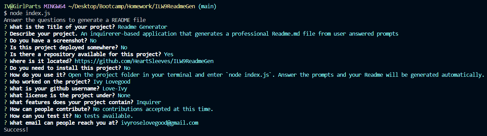

# Readme Generator

## Description

Generates professional Readme.md files from user answered prompts

## Screenshot

[Video](./assets/video/demonstration.webm)

## Table of Contents

- [Installation](#installation)
- [Usage](#usage)
- [Links](#links)
- [Credits](#credits)
- [License](#license)

## Installation

Installation is not required

## Usage

Open the project file in your terminal. Enter `node index.js` to start the application. Answer the prompts and your Readme will be automatically generated in the project folder.

## Links

- Deployment: This project is not deployed
- Repository: https://github.com/HeartSleeves/ILW9ReadmeGen

## Credits

- Creator: Ivy Lovegood
- Github: https://github.com/Love-Ivy

## License

## Features

Inquirer, License badges

## How to Contribute

No contributions accepted at this time.

## Tests

No tests available.

## Questions?

Email me at: ivyroselovegood@gmail.com
